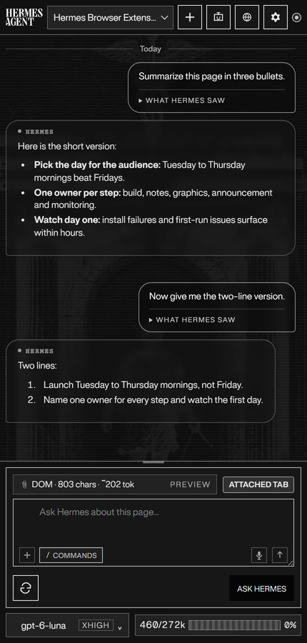
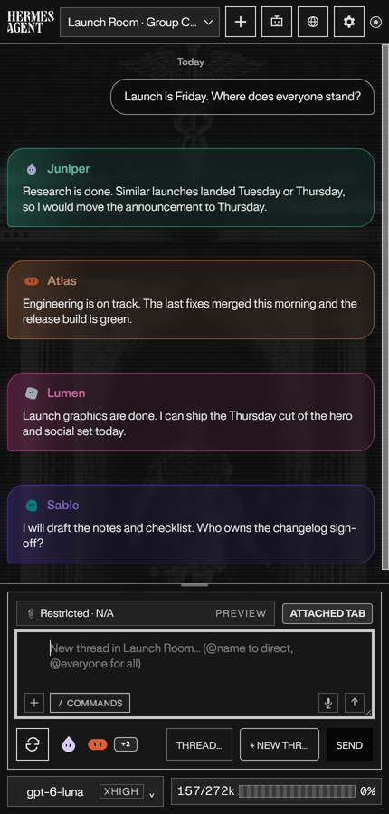
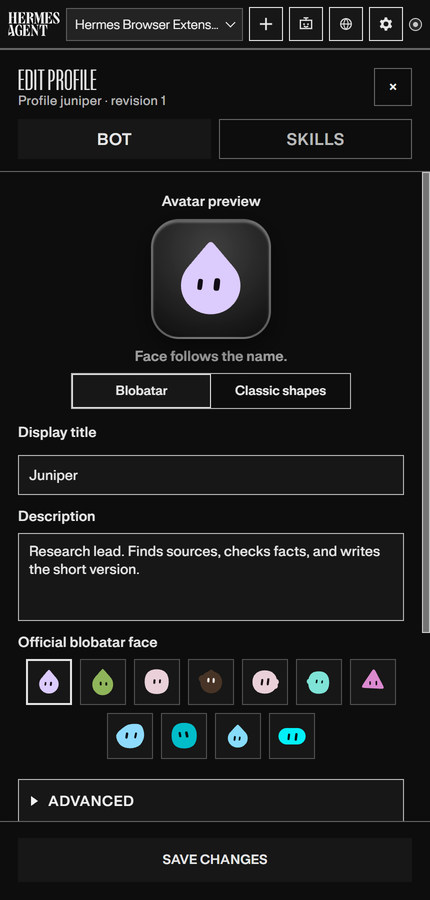
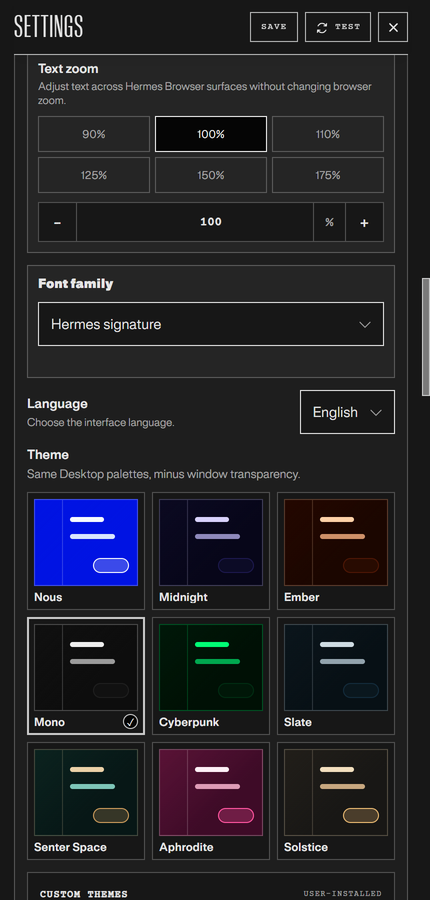
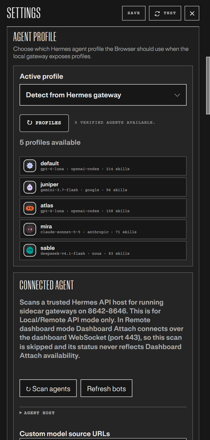
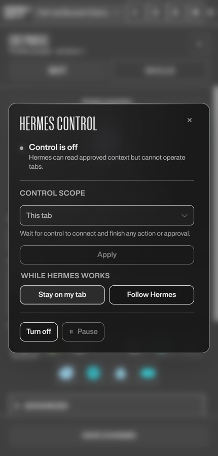

# Hermes Browser Extension

Browser-native side panel for [Hermes Agent](https://hermes-agent.nousresearch.com/docs) — connect active web context through a local gateway, Hermes Cloud, or a self-hosted remote gateway.

> Created by **Jon Komet** (`@abundantbeing`). Community extension for Hermes Agent by Nous Research.

<p align="center">
  
</p>

<p align="center">
  <strong>Public v0.3.4 · Load unpacked · Local / Hermes Cloud / Remote · Full Hermes runtime tools</strong><br />
  </p>

<p align="center">
  <a href="https://ko-fi.com/T8Z726J5YZ"></a>
</p>

## What it is

Hermes Browser Extension is not a browser chatbot. It is a Chrome/Edge/Chromium side panel for the real Hermes Agent runtime. Choose a local gateway, attach to a signed-in Hermes Cloud agent tab, or connect to a self-hosted remote API/dashboard. Local and remote API connections can use the models, tools, skills, sessions, memory, and MCP servers already configured in Hermes; Cloud and dashboard-ticket connections are intentionally Chat-only.

- **Bot Mode** brings your Hermes agent roster into the panel: switch agents, edit profiles, and run group chats where several agents reply in one room.
- **Browser Control** changes which tabs a turn reads from the composer: This tab, Selected tabs, or a Task set of tabs you pick explicitly.
- **Message tools**: Copy, Edit, and Restore checkpoint on supported turns, with day dividers, message times, and theme-aware bubbles.
- **Hermes Assist** drafts beside supported text composers and never sends, posts, or submits for you.
- **Page comments**: pick an element, write a note, and queue pins beside Ask Hermes.
- **Appearance**: Light, Dark, or System mode, nine themes, text zoom, and a font list. Nous Light is a white theme with Nous Blue accents.


The full list of changes per version lives in the [changelog](./CHANGELOG.md) and the [releases](https://github.com/abundantbeing/hermes-browser-extension/releases).

## Visual tour

Screenshots use the Mono theme in Dark mode.

| Side panel | Bot chats | Edit a bot |
| --- | --- | --- |
|  |  |  |
| Theme settings | Local agents | Hermes Control |
|  |  |  |

## Requirements

- Hermes Agent installed and working.
- For Local or Remote API mode: Hermes Gateway/API server enabled locally or on a reachable remote machine. Hermes Cloud instead requires a signed-in HTTPS agent tab.
- Node.js 20+.
- Chrome, Edge, Brave, Comet, or another Chromium browser with Side Panel API support (Chrome 116+ baseline). Firefox 142+ is supported via [AMO](https://addons.mozilla.org/en-US/firefox/addon/hermes-browser-extension/), the Mozilla Add-ons listing. `npm run build:firefox` is for local/dev Firefox builds only.

## Firefox scope

Hermes Browser Extension on Firefox is a chat-and-context client: pairing, the side panel, streaming replies, attachments, and page-context capture all work, but real-tab attach ("Hermes Control") is Chromium-only. Firefox WebExtensions have no equivalent to Chromium's `debugger` API, so the Firefox package omits that permission and the panel reports Control unavailable with an explanation instead of failing silently.

If you need Hermes to click, type, scroll, or operate tabs on your behalf, load the extension in Chrome, Edge, Brave, or another Chromium browser. The full compatibility matrix is in [guides/connection-guide.md](./guides/connection-guide.md).

## Quick start

### 1. Clone and build

```bash
git clone https://github.com/abundantbeing/hermes-browser-extension.git
cd hermes-browser-extension
npm install
npm run build
```

The loadable extension is generated at:

```text
dist/
```

### 2. Load unpacked in Chrome/Edge

1. Open `chrome://extensions` or `edge://extensions`.
2. Enable **Developer mode**.
3. Click **Load unpacked**.
4. Select this repo's `dist/` folder — not the repo root and not `extension/`.
5. Pin/click the Hermes extension icon to open the side panel.

After code updates, run `npm run build` again and click **Reload** on the Hermes Browser Extension card in the browser extensions page.

### 3. Install in Firefox

1. Open [AMO](https://addons.mozilla.org/en-US/firefox/addon/hermes-browser-extension/) in Firefox.
2. Click **Add to Firefox** and confirm the permission prompt.
3. The extension opens in the Firefox sidebar (Ctrl+Shift+H).

Because this package is Mozilla-hosted on AMO, Firefox receives future signed updates through AMO automatically. No separate update manifest or manual reinstall is required.

Do not sideload the GitHub source zip/tar.gz. Those are source archives, not a Firefox add-on.

## Connect to Hermes

Settings exposes the same three product-level choices as Hermes Desktop:

| Connection mode | Use it for | Transport and boundary |
| --- | --- | --- |
| **Local gateway** | Hermes running on this machine | Local API server, default `http://127.0.0.1:8642`, with a scoped browser token or `API_SERVER_KEY`. |
| **Hermes Cloud** | A signed-in Hermes Cloud agent open in a normal browser tab | Trusted Dashboard Attach mints a short-lived, single-use WebSocket ticket from the active HTTPS agent tab. Chat-only; no page text, selected text, open-tab context, or attachments are sent. |
| **Remote gateway** | A self-hosted Hermes backend on another machine or behind a trusted proxy | With a key: remote API server. Without a key: signed-in HTTPS dashboard ticket/WebSocket. |

Existing installations migrate automatically: prior `local-api` settings become Local gateway, while prior `remote-api` and `remote-dashboard` settings remain Remote gateway. A legacy remote dashboard is never silently relabeled as Hermes Cloud.

### Local API server

Local-only is the safest default. Put this in your Hermes `.env` on the machine running Hermes: `%LOCALAPPDATA%\hermes\.env` on native Windows, `~/.hermes/.env` on Linux/macOS/WSL, or `$HERMES_HOME/.env` if you relocated the data dir or use a named profile:

```bash
API_SERVER_ENABLED=true
API_SERVER_HOST=127.0.0.1
API_SERVER_PORT=8642
API_SERVER_KEY=<your-api-server-key>
API_SERVER_CORS_ORIGINS=chrome-extension://<your-extension-id>
```

Start or restart the gateway:

```bash
hermes gateway run
```

Verify the API server:

```bash
HERMES_GATEWAY_URL=http://127.0.0.1:8642
HERMES_API_TOKEN='<your-api-server-key-or-browser-token>'
curl "$HERMES_GATEWAY_URL/health"
curl -H "Authorization: Bearer $HERMES_API_TOKEN" "$HERMES_GATEWAY_URL/v1/models"
```

Then in the extension side panel:

1. Click **Connect to Hermes** and approve locally if your Hermes Desktop/gateway supports the approval flow.
2. If approval is not available yet, click **Manual setup**.
3. Choose **Local gateway**.
4. Use Gateway URL `http://127.0.0.1:8642`.
5. Paste your scoped browser token or `API_SERVER_KEY`.
6. Click **Test connection**, then **Save settings**.
7. Open a normal `https://` page and ask: `Summarize this page in one sentence.`

### Remote and Cloud

For a remote machine, bind the API server to a reachable trusted interface and keep CORS narrow. Use a private same-LAN/Tailscale/VPN host with HTTP, or put the API server behind a trusted HTTPS reverse proxy. Do **not** expose the Hermes API server naked to the public internet.

Hermes Cloud uses **Trusted Dashboard Attach**: open your Hermes Cloud agent in a normal browser tab, sign in, choose **Hermes Cloud** in Settings, and click **Connect to Hermes**. The ticket stays in memory only and is never persisted or logged. Cloud is **Chat-only** in this release.

Full setup for remote API servers, self-hosted dashboards, and what syncs after connection is in [guides/connection-guide.md](./guides/connection-guide.md).

## Security model

Hermes Browser Extension is intentionally conservative in v0.3.0:

- Local gateway by default; remote API server support requires an explicit URL, token, and CORS allowlist.
- Hermes Cloud and self-hosted dashboard attach require an explicit HTTPS origin, the exact active signed-in tab, and a short-lived single-use WebSocket ticket kept only in memory.
- Cloud/dashboard-ticket connections are Chat-only and cannot send browser page text, selected text, open-tab context, or attachments.
- Strong bearer/API key required for API access.
- Page content is wrapped as untrusted context before it reaches Hermes.
- Credential-bearing URLs are omitted from active, selected, open-tab, pinned-scope, prompt, receipt, and payload-hash surfaces.
- Read-only browser context capture and no autonomous page control. Hermes Assist may insert a reviewed draft into a supported focused composer only after an explicit user action; it never clicks Send/Post/Submit, navigates, checks out, or performs browser-control workflows.
- No `debugger`, `nativeMessaging`, `cookies`, `history`, or `bookmarks` permissions. `downloads` is limited to explicit user-requested generated-image/artifact saves.
- Restricted pages include browser internals, extension pages, and obvious banking/crypto/password/payment/health/government-tax categories.

See [`SECURITY.md`](SECURITY.md), [`PERMISSIONS.md`](PERMISSIONS.md), [`DATA-FLOW.md`](DATA-FLOW.md), and [`PRIVACY.md`](PRIVACY.md) for details.

## Troubleshooting

### I loaded the extension but nothing works

Make sure you loaded `dist/`, not the repo root. The selected folder must contain `manifest.json` directly.

### Chrome still shows an older version after updating

The browser is still using an old unpacked folder or an unpacked extension card that was not reloaded. For v0.3.4, the source manifest, built `dist/` manifest, and release archive should all contain `manifest.json` version `0.3.4`.

Fix:

1. Extract/download the v0.3.4 release or run `npm run build` locally.
2. Open `chrome://extensions` or `edge://extensions`.
3. On the Hermes Browser Extension card, click **Reload**.
4. If it still shows an older version, click **Remove**, then **Load unpacked** again and select the fresh v0.3.4 `dist/` folder.
5. Click **service worker** / **Inspect views** only for debugging; it is not the version source.

### Filing a support issue

Open Settings → **Support diagnostics** → **Copy Diagnostics** and paste the report into the GitHub issue or support thread.

The copied block includes version/build, browser family, gateway origin, connection state, runtime capability flags, selected model/provider, context mode, extractor mode, last visible error, and a bounded gateway failure classification when available. It intentionally excludes API keys, bearer tokens, cookies, page text, selected text, tab titles, raw tracebacks, local paths, and full tab URLs.

### The side panel says it cannot connect

Check that Hermes Gateway/API server is running and reachable from the browser:

```bash
curl http://127.0.0.1:8642/health
# or, for remote mode:
curl http://<trusted-remote-host>:8642/health
```

If `/v1/models` fails, check `API_SERVER_KEY`, the extension's stored API key/browser token, and `API_SERVER_CORS_ORIGINS`. For remote mode, the browser extension origin (`chrome-extension://<id>`) must be allowlisted on the Hermes machine.

If the browser only reports a failed fetch, it cannot prove whether the gateway refused the connection, blocked the request, or received a turn before the response was lost. The side panel keeps the draft and offers **Check connection**. It never resends automatically. Check the session history before manually sending again, since a dropped response can leave delivery unconfirmed and a second send could duplicate the turn. An answered `/health` probe confirms reachability at probe time, not that the earlier turn failed because of CORS.

More troubleshooting, including runtime warnings and native Hermes computer use, is in [guides/troubleshooting.md](./guides/troubleshooting.md).

## Development

```bash
npm test
npm run check:js
npm run check:manifest
npm run verify
npm run build
npm run package
```

```text
extension/          MV3 source: sidepanel, background worker, content scripts, lib/
companion-plugin/   optional read-only Browser context cache tools and hooks
scripts/            build, Firefox packaging, manifest checks
tests/              node:test suite
dist/               generated unpacked build (load this one)
```

## Relationship to Hermes Agent

[Hermes Agent](https://github.com/NousResearch/hermes-agent) is an open-source project by Nous Research. Hermes Browser Extension is a community extension by Jon Komet that connects through a local gateway, Hermes Cloud agent tab, or self-hosted remote gateway. It is designed to live at the edge of the ecosystem without adding core tool-schema footprint.

Useful links:

- Hermes docs: <https://hermes-agent.nousresearch.com/docs>
- Hermes API server docs: <https://hermes-agent.nousresearch.com/docs/user-guide/features/api-server>
- Hermes upstream repo: <https://github.com/NousResearch/hermes-agent>

## Star History

<a href="https://www.star-history.com/?repos=abundantbeing%2Fhermes-browser-extension&type=timeline&legend=bottom-right">
 <picture>
   <source media="(prefers-color-scheme: dark)" srcset="https://api.star-history.com/chart?repos=abundantbeing%2Fhermes-browser-extension&type=timeline&theme=dark&legend=bottom-right&sealed_token=GF2Z0Dz8jAbfQ0SpqcdyUM458IUVYJKcy5MvICCmRG32E-UfAG6Ifb8GTV6LXCDIhyY0J5WPOLlIKbSrn1F9Me-7Zrpt3XoN-eFEkORrH9Kg6WT433Gtug" />
   <source media="(prefers-color-scheme: light)" srcset="https://api.star-history.com/chart?repos=abundantbeing%2Fhermes-browser-extension&type=timeline&legend=bottom-right&sealed_token=GF2Z0Dz8jAbfQ0SpqcdyUM458IUVYJKcy5MvICCmRG32E-UfAG6Ifb8GTV6LXCDIhyY0J5WPOLlIKbSrn1F9Me-7Zrpt3XoN-eFEkORrH9Kg6WT433Gtug" />
   
 </picture>
</a>

## Contributors

External contributions that have shipped are credited in [`CONTRIBUTORS.md`](CONTRIBUTORS.md).

## Author

Built by **Jon Komet** (`@abundantbeing`). If this extension saves you time, [support the work on Ko-fi](https://ko-fi.com/T8Z726J5YZ).

## License

MIT. See [`LICENSE`](LICENSE).
